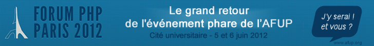
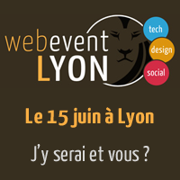

Cette année, M6Web sponsorise deux événements français majeurs dans le monde du Web :

- le Web Event à Lyon #4 ([http://event.lafermeduweb.net/ ](http://event.lafermeduweb.net/)au centre de congrès de Lyon le 15 juin 2012)
- et le forumPHP 2012 ([http://afup.org/pages/forumphp2012/](http://afup.org/pages/forumphp2012/) la Cité universitaire à Paris le 5 & 6 juin 2012) !

A cette occasion, M6Web sera bien représenté :

- je (Kenny Dits) présenterais chaque évènement des sessions sur le monitoring applicatif en regard de ce que nous faisons au quotidien chez M6Web. [http://afup.org/pages/forumphp2012/sessions.php#632](http://afup.org/pages/forumphp2012/sessions.php#632)  
[http://event.lafermeduweb.net/les-sessions#c6](http://event.lafermeduweb.net/les-sessions#c6)
- Olivier Mansour en tant que Vice Président de l’Afup parlera lors de la Keynote de cloture du Forum Php le 6 juin. [http://afup.org/pages/forumphp2012/sessions.php#732](http://afup.org/pages/forumphp2012/sessions.php#732)
- Martin Boronski, notre directeur technique participera également à la table ronde DSI organisée par l’AFUP Paris le 6 Juin.

Rendez-vous là bas ? ;-)

Bannière du Forum PHP 2012

Bannière du Web Event Lyon

