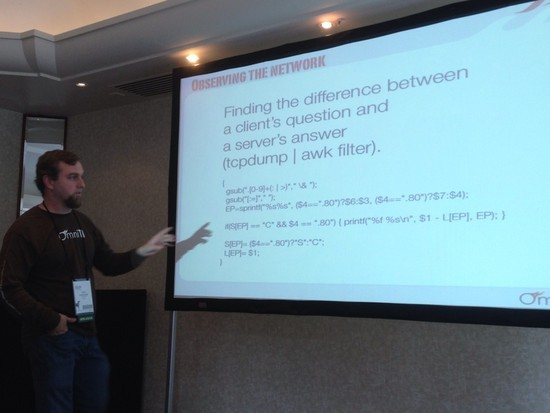
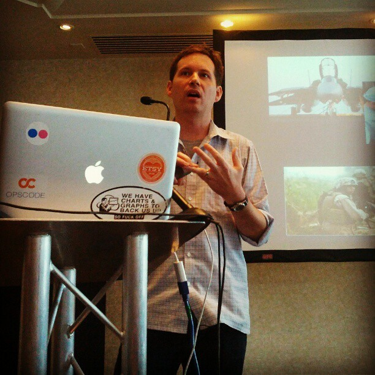
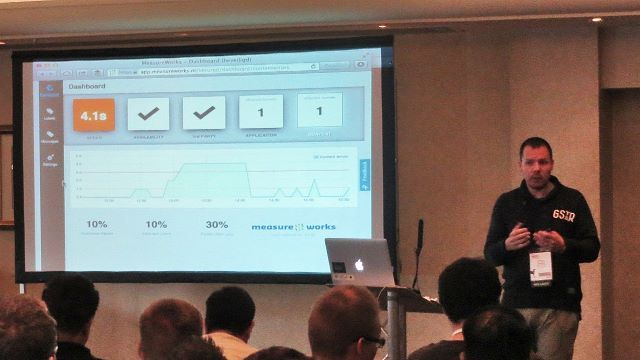
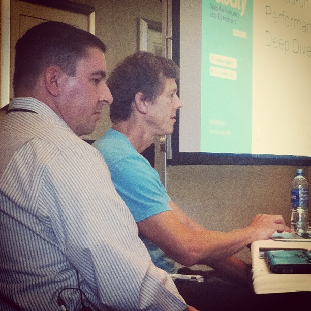
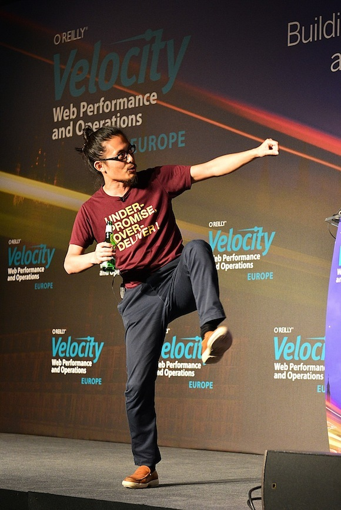

Nous voici de retour pour une Vélocity Conference, le paradis de la WebPerf et des Devops !

Après l'excellente moisson de la Vélocity US de Santa Clara, dont voici nos 3 CR :

- Day 1 : [http://tech.m6web.fr/cr-velocity-conference-day-1-dev-webperf](http://tech.m6web.fr/cr-velocity-conference-day-1-dev-webperf)
- Day 2 : [http://tech.m6web.fr/cr-velocity-conference-2012-day-2-devops-webperf](http://tech.m6web.fr/cr-velocity-conference-2012-day-2-devops-webperf)
- Day 3 : [http://tech.m6web.fr/cr-velocity-conference-2012-day-3-devops-webperf](http://tech.m6web.fr/cr-velocity-conference-2012-day-3-devops-webperf)

Et après la session de l'année dernière qui avait lieu à Berlin, nous nous retrouvons cette fois dans la capitale anglaise Londres, au Hilton hôtel.

Voici le compte rendu des conférences de la première journée, journée un peu à part placée sous le signe des "Tutorials" (2 octobre 2012)

### [OPS] Monitoring and Observability in complex architecture, par Theo Schlossnagle (OmniTI)

Première conférence de la journée, avec Theo, habitué des Velocity, et plutôt expert dans les domaines "infra" et "monitoring". Créateur de [Omniti](http://omniti.com/), MessageSystems et [Circonus.](http://circonus.com/)

Son twitter : [@postwait](https://twitter.com/postwait)

Theo nous explique comment monitorer et observer des archi complexes avec une présentation très bas niveau.

Les outils de collectes de statistiques qu'il cite :

- Metrics.js : [https://github.com/mikejihbe/metrics](https://github.com/mikejihbe/metrics)
- Resmon : [http://labs.omniti.com/labs/resmon](http://labs.omniti.com/labs/resmon)
- Folsom : [https://github.com/boundary/folsom](https://github.com/boundary/folsom)
- Metrics : [http://metrics.codahale.com/](http://metrics.codahale.com/)
- Metrics-net : [https://github.com/danielcrenna/metrics-net](https://github.com/danielcrenna/metrics-net)
- StatsD : [https://github.com/etsy/statsd](https://github.com/etsy/statsd)

Et pour le stockage :

- Reconnoiter : [http://labs.omniti.com/labs/reconnoiter](http://labs.omniti.com/labs/reconnoiter)
- Graphite : [http://graphite.wikidot.com/](http://graphite.wikidot.com/)
- OpenTSDB : [http://opentsdb.net/](http://opentsdb.net/)
- Circonus : [http://circonus.com/](http://circonus.com/)
- Librato : [https://metrics.librato.com/](https://metrics.librato.com/)

Ont suivi ensuite des démos tcpdump assez poussées plutôt intéressante :  
 Par exemple, pour voir les nouvelles connexions entrantes (récupération des packets SYN) : tcpdump -nnq -tttt -s384 'tcpport 80 and(tcp[13] & (2|16) == 2)'

+ d'exemples sont disponibles dans les slides, avec aussi d'autres exemples live sur "strace" et "dtrace".

Bref, ca commence très (trop?) fort, surtout pour nous, pas forcément de nature très "OPS" !

Les slides sont disponible ici et plutôt parlantes pour ceux qui voudraient creuser le sujet : [http://www.slideshare.net/postwait/monitoring-and-observability](http://www.slideshare.net/postwait/monitoring-and-observability)

<iframe allowfullscreen="" frameborder="0" height="356" marginheight="0" marginwidth="0" scrolling="no" src="http://fr.slideshare.net/slideshow/embed_code/14556223" style="border:1px solid #CCC;border-width:1px 1px 0;margin-bottom:5px" width="427"></iframe>

> "You cannot correct what you cannot measure" Theo Schlossnagle

Theo Schlossnagle (Source : http://img.ly/o0Ht )

### [DevOps] Escalading Scenario : a deep dive into outage falls, par John Allspaw (Etsy)

On prend toujours autant de plaisir écouter John Allspaw, VP d'Esty et Co-organisateur de la Vélocity avec Steve Souders, nous parler d'incident, et de la meilleure manière de les gérer.

Son Twitter : [@allspaw](https://twitter.com/allspaw)

Beaucoup de parallèles sont faits avec des incidents dans l'aviation, l'industrie, voir l'armée, avec des références aussi au PostMortem d'appolo 13 ... Un joli condensé de bouquins "Must Read" d'après Allspaw comme : [Normal Accidents](http://www.amazon.co.uk/Normal-Accidents-Technologies-Princeton-Paperbacks/dp/0691004129) ou encore [Naturalistic Decision Making](http://www.amazon.fr/Naturalistic-Decision-Making-Caroline-Zsambok/dp/080581874X/ref=sr_1_1?ie=UTF8&qid=1349212572&sr=8-1), nous sont présentés.

Difficile d'en faire un résumé, tellement la conférence était bourrée d'informations, graphiques et anecdotes en tout genre ! Malgré tout, dans les "choses" retenir, en vrac :

- Attention au contexte de vos graphiques : un graph qui parait anormal sur une heure, peut s'avérer normal sur une échelle de temps d'une journée par exemple
- Des bons conseils sur la résolution d'incident en équipe, notamment au niveau de la communication avec des exemples de conversation pendant des incidents chez Etsy trop ambigus. Il est important de confirmer les réponses, corriger la communication des autres, afin d'éviter tout soucis de compréhension
- Ne pas hésiter à demander des "pre-mortem". Dire à l'auteur du projet par exemple, que cela va planter dans plusieurs mois, et lui demander d'essayer de trouver la ou les raisons qui pourraient amener le projet au plantage.
- ...

Je vous invite encore consulter les slides pour plus d'informations et de références : [http://fr.slideshare.net/jallspaw/velocity-eu-2012-escalating-scenarios-outage-handling-pitfalls](http://fr.slideshare.net/jallspaw/velocity-eu-2012-escalating-scenarios-outage-handling-pitfalls)

<iframe allowfullscreen="" frameborder="0" height="356" marginheight="0" marginwidth="0" scrolling="no" src="http://fr.slideshare.net/slideshow/embed_code/14567676?rel=0" style="border:1px solid #CCC;border-width:1px 1px 0;margin-bottom:5px" width="427"></iframe>

John Allspaw (Source : https://twitter.com/lozzd/status/253074489540239360 )

### [WebPerf] Running a WebPerf Dashboard in 90 minutes, par Jeroen Tjepkema

Son twitter : [@jeroentjepkema](https://twitter.com/jeroentjepkema)

L'objectif de cette conférence était de proposer en 90 minutes, les étapes nécessaire pour monter un dashboard orienté WebPerf.

On re-parcourt du coup un peu tout le classique de la performance web, en présentant déjà quelques exemples de Dashboard (rien de très sexy ..., hormis peut-être [celui de Nrc.nl](http://www.nrc.nl/apps/bigboard/) orienté "audience éditoriale" plutot intéressant), la pertinence de certains types de "graphs" comme les "heatmap" et aussi en comparant les différentes solutions pour mesurer la performance web, avec avantages et inconvénients :

- Synthetic Monitoring (Gomez, Keynote, IpLabel, Pingdom etc) (slide 104-105)
- Real User Monitoring ([LogNormal](http://lognormal.com/) dont [l'acquisition par Soasta](http://lognormal.com/blog/2012/10/01/lognormal-acquired-by-soasta/) a aussi été annoncé ce jour, [Boomerang.js](http://lognormal.github.com/boomerang/doc/), Torbit, Google Analytics ...) (slide 121-122)
- Real User Benchmarking ([WebPageTest](http://www.webpagetest.org)) (slide 134)

Quelques idées sympa de design sont disséminées tout au long de cette longue présentation, on regrette simplement de survoler toujours un peu tous les concepts, mais malgrés tout, cela reste l'une des rares tentatives de faire un dashboard WebPerf accessible à des "non-techniciens". Chapeau pour cela.

Une démo du dashboard est testable ici : [https://app.measureworks.nl/secured/dashboard](https://app.measureworks.nl/secured/dashboard) (Login : demo@measureworks.nl , password: performance )

Les slides sont disponibles ici : [http://www.slideshare.net/MeasureWorks/measureworks-velocity-conference-europe-2012-a-web-performance-dashboard-final](http://www.slideshare.net/MeasureWorks/measureworks-velocity-conference-europe-2012-a-web-performance-dashboard-final)

<iframe allowfullscreen="" frameborder="0" height="356" marginheight="0" marginwidth="0" scrolling="no" src="http://fr.slideshare.net/slideshow/embed_code/14559201?rel=0" style="border:1px solid #CCC;border-width:1px 1px 0;margin-bottom:5px" width="427"></iframe>

Jeroen Tjepkema (Source : https://twitter.com/pingdom/status/253135289327951872 )

### [WebPerf] Deep Dive into Performance analysis, par Steve Souders et Patrick Meenan (Google)

Leurs Twitter : [@souders](https://twitter.com/souders) et [@patmeenan](https://twitter.com/patmeenan)

Dernier "Tutorials" du jour avec Steve Souders (Chief performance Officer chez Google), et Patrick Meeman (aussi chez Google désormais, créateur de Webpagetest).

Histoire de s'adapter au public Anglais, les deux compères ont décidés de s'attaquer aux sites des équipes de Premier League du Foot Anglais :-)

Comme imaginé, ca n'est pas "folichon", et on étudiera en profondeur en live les sites de Chelsea et Tottenham, qui chacun enchaine un nombre d'aberrations plus grandes les une que les autres !

Le tableur utilisé pendant la présentation avec les liens vers les tests WebPageTest : [goo.gl/YfbRn](http://goo.gl/YfbRn)

Quelques exemples sur le site de Chelsea : [http://www.chelseafc.com/](http://www.chelseafc.com/)

Les tests WPT annoncent un Load Time 21 secondes, 203 requêtes HTTP et 3mo4 téléchargés !

Le [Waterfall que vous pouvez voir ici](http://velocity.webpagetest.org/result/120925_0_13/2/details/), est on ne peut plus parlant, avec une mention spéciale pour la liste des images présentes sur la HP : [http://velocity.webpagetest.org/pageimages.php?test=120925_0_13&run=2&cached=0](http://velocity.webpagetest.org/pageimages.php?test=120925_0_13&run=2&cached=0)

J'imagine que le problème va vous sauter aux yeux, entre les fonds énormissimes et images non compréssées, les images de chacun des joueurs de l'équipe (oui, le pauvre carroussel en bas de page ...), et le nombre incroyable de logo et ou picto en tout genre, on voit vite comment améliorer la page :-)

Le carroussel du haut donne aussi un effet assez comique sur le "[FilmStrip View](http://velocity.webpagetest.org/video/compare.php?tests=120925_0_13-r:2-c:0)" où l'ont voit vers les 10 secondes, un début d'image se charger, pour s'effacer car le carroussel passe déja au panel suivant ... Merci au passage au jCaroussel qui charge bêtement toutes les images ...

On remarque aussi un nombre conséquent de JS qui retarde grandement le Start Render. Optez autant que possible pour les positionner juste avant le /body, ou les charger en async/defer ou via un chargement asynchrone en Js.

Pas mal de petites astuces sont partagées par Patrick et Steve, notamment sur l'utilisation de la courbe de Bande Passante, pour voir les parties pouvant être optimisées (celle ou la bande passante n'est pas utilisée fond par exemple), on remarque aussi quelques ajouts récents comme l'affichage des évenements Paint sur la FilmStrip View (Screenshot encadré de Orange), ou encore la possibilité via clic droit dans la Chrome Dev Tools de vider le cache et les cookies rapidement etc ...

Nous avons aussi eu la confirmation que Google prenait le Onload Time comme référence pour ses algorithmes de ranking.

Bref, superbe application de tous les concepts WebPerf avec des cas concrets d'étude et une conférence très interactive avec suffisament d'astuces pour combler aussi les habitués de WPT.

Patrick Meenan & Steve Souders (Source : https://twitter.com/simonox/status/253146271156670464 )

### [DevOps] Ignite Talk

Pour finir cette journée, rendez vous dans l'immense salle (dans laquelle aura lieu la majorité des conférences suivantes), pour un Ignite Talk combiné entre la Vélocity Conférence et Strata Conférence qui ont lieu au même moment dans l'Hilton hôtel Londres.

Salle King's Room (Source : https://twitter.com/cmsj/status/253139957093367808/photo/1 )

Nous suivrons une série de 7 ou 8 Ignite Talk dont le concept est de présenter un sujet sur 20 slides défilant automatiquement toutes les 15 secondes. C'est assez décalé, fun, et l'exercice parait très "sport" ... :)

Pas mal de sujets tournaient autour de l'Open Data ou Big Data, les DataViz ...

Voici par exemple un talk sympa sur les "Dataviz as interface" par [@makoto_inoue](https://twitter.com/makoto_inoue) : [http://fr.slideshare.net/inouemak/data-viz-asinterfacemakotoinoue](http://fr.slideshare.net/inouemak/data-viz-asinterfacemakotoinoue)

<iframe allowfullscreen="" frameborder="0" height="356" marginheight="0" marginwidth="0" scrolling="no" src="http://fr.slideshare.net/slideshow/embed_code/14559951" style="border:1px solid #CCC;border-width:1px 1px 0;margin-bottom:5px" width="427"></iframe>

Makoto Inoue, de l'énergie, de la danse, et de la bière ! (Source: http://royal.pingdom.com/2012/10/02/velocity-europe-1/ )

### [WebPerf] Step by Step Mobile Optimization, par Guy Podjamy (Akamai)

Conférence auquelle je n'ai pas pu assisté : [http://fr.slideshare.net/guypod/step-by-step-mobile-optimization](http://fr.slideshare.net/guypod/step-by-step-mobile-optimization)

<iframe allowfullscreen="" frameborder="0" height="356" marginheight="0" marginwidth="0" scrolling="no" src="http://fr.slideshare.net/slideshow/embed_code/14569754" style="border:1px solid #CCC;border-width:1px 1px 0;margin-bottom:5px" width="427"></iframe>

### Conclusion :

Bonne première journée avec déjpas mal de choses retenir et appliquer quotidiennement !

On regrette le fait d'avoir été dans des petites salles (sûrement à cause de la dernière journée de la Strata Conférence), et du coup d'avoir alterné le manque de place, avec la chaleur des salles ... Et je n'ai pas l'impression que les sessions du jour étaient filmées malheuresement !

C'est en tout cas un très bon avant-gout de ce qui nous attend demain ;-)

Enjoy !

P.s : N'hésitez pas nous faire des retours sur ce CR ! :)

Rappel : les CR des autres jours sont disponible :

- Day 2 : [http://tech.m6web.fr/cr-velocity-conference-europe-2012-day-2](http://tech.m6web.fr/cr-velocity-conference-europe-2012-day-2)
- Day 3 : [http://tech.m6web.fr/cr-velocity-conference-europe-2012-day-3](http://tech.m6web.fr/cr-velocity-conference-europe-2012-day-3)
