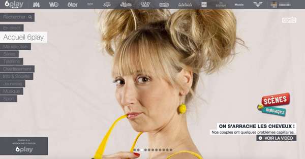

Nous vous parlions en fin d'année dernière sur ce blog, de notre vision de [la Single Page App parfaite](http://tech.m6web.fr/isomorphic-single-page-app-parfaite-react-flux/).

Nous avons donc travaillé depuis le début d'année à la mise en place du nouveau 6play sur cette stack technologique :

* [React](https://facebook.github.io/react/)(isomorphic/[universal](https://medium.com/@mjackson/universal-javascript-4761051b7ae9)) avec du Node.js en backend
* [Fluxible](http://fluxible.io/) pour la gestion de Flux client et serveur
* [webpack](http://webpack.github.io/) pour la gestion du build js coté client
* [React Router](https://github.com/rackt/react-router) pour le routing
* ES6 avec [Babel](https://babeljs.io/) parce que.

Au niveau tests, et parce que nous ne concevons plus de développer de tels projets sans une approche qualité complète : 

* [ESLint](http://eslint.org/) pour le respect des conventions de codage
* [Jest](https://facebook.github.io/jest/) pour les tests unitaires
* [Cucumber.js](https://cucumber.io/docs/reference/javascript), [WebdriverIO](http://webdriver.io/) et [PhantomJS](http://phantomjs.org/) pour les tests fonctionnels
* [superagent-mock](https://github.com/M6Web/superagent-mock) (\o/) pour mocker les requêtes HTTP des services externes
* [Jenkins](https://jenkins-ci.org/) pour l'intégration continue
* [React Hot Loader](https://github.com/gaearon/react-hot-loader) pour améliorer la DX (Developer eXperience)

Depuis lundi, vous pouvez désormais tester la bêta de ce service vidéo à l'adresse suivante : [http://beta.6play.fr](http://beta.6play.fr)

Pour ceux qui veulent en savoir plus sur cette refonte (notamment front-end), une conférence sera tenue par Kenny Dits ([@kenny_dee](https://twitter.com/kenny_dee)) lors de [Blend Web Mix](http://www.blendwebmix.com/programme.html), le 29 octobre à Lyon à 16h.
