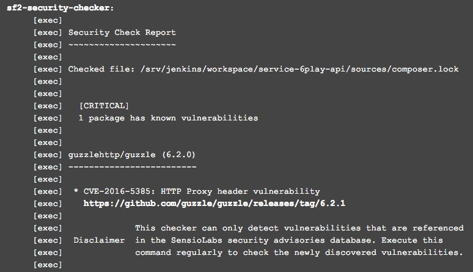

Numerous vulnerabilities are detected every day. That's a good thing and a key benefit of using open source products. At m6web we don't want to be exposed to known vulnerabilities, so we use a service provided by Sensiolabs in our continuous integration tool ([Jenkins](https://jenkins.io/)) to check it.
 
 
 
Just add those lines in your ant build file (and adapt basedir) :  
 
 ```xml
    <!-- =================================================================== -->
    <!-- Security checker                                                    -->
    <!-- =================================================================== -->
    <target name="sf2-security-checker">
     <exec executable="bash" dir="${basedir}/sources/bin" failonerror="true">
         <arg value="-c"/>
         <arg value="curl -Os http://get.sensiolabs.org/security-checker.phar" />
     </exec>
     <exec executable="php" dir="${basedir}/sources" failonerror="true">
         <arg line="${basedir}/sources/bin/security-checker.phar security:check composer.lock" />
     </exec>
    </target>
```

And automatically check your `composer.lock` againts vulnerabilities. Your build will fail if something wrong is detected. 

For example, with the recent [Guzzle](https://security.sensiolabs.org/database?package=guzzlehttp/guzzle) one : 



You can contribute to the [vulnerabilities database](https://github.com/FriendsOfPHP/security-advisories) and the [checker](https://github.com/sensiolabs/security-checker) via Github.com.
