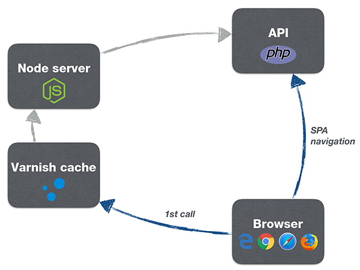
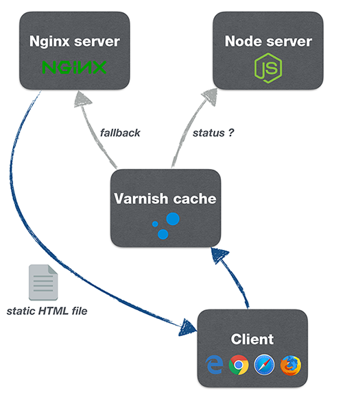

For more than a year and a half, we use [Node.js](https://nodejs.org/en/) and [React](https://facebook.github.io/react/) together to make the best app possible for our users. These 2 technologies are complementary to write only once code executed on the server and the client side: that’s the isomorphic way! This approach helped us to develop a reliable app with [a fast first render and SEO friendly](/isomorphic-single-page-app-parfaite-react-flux/).

## SSR caching

Here is the architecture we use for the 6play web app.

You can see that Node.js server responses are cached with [Varnish](https://varnish-cache.org/). Indeed, React is not efficient with server side rendering because it just has not been designed for that. The React `renderToString` method blocks the event loop. Consequently the server can not process an acceptable responses rate for a service like 6play that can reach a lot of requests per second without cache. Particularly when the European Football Championship final bring together France and Portugal and is live or when the last episode of « Les Marseillais », one of the teenagers favorite programs, has just been released on the platform. So caching server responses, with a quite low caching time, is required for our application health!

## SPA mode

Isomorphism enables search engines to parse our website without executing any line of JavaScript, only using the server side rendering. We thought that the opposite could be useful too. Imagine our Node servers are down, for various reasons. Our Varnish servers continue to deliver the application pages but only during the cache time. After, the user would get an error… or not!

In this case, we would switch to a [Nginx](https://nginx.org/en/) server that simply delivers a blank page with the client JavaScript code. The server was responsible for the app state initialization before, the user browser has to do so now. Then it can render the page: our application becomes a simple SPA. And this is almost imperceptible for the user, the first render is just a little longer. This way secures the availability of our service.

The Varnish servers check the status of the Node ones via a specific route. When every instance is down, they route all requests to a static HTML file on the Nginx server.

## Really useful ?
  
Yes! It is not used until it is! A few months ago we went through a memory leak. Consequences? After some time, we saw an increase in CPU usage, then the servers fell down and SPA mode was enabled. We didn’t notice the memory leak immediately because we often deploy new versions of our app and it resets the memory. When we detected the problem, it was too late to rollback because the incriminated version was probably weeks or months old.

You certainly know how difficult it is to find the code responsible for a memory leak in Node.js. It is often not a matter of hours but of days or weeks. With our SPA mode, we could debug our code with serenity. When the Node servers were down, the SPA mode took the reins. Then we simply restart the server to restore the nominal state when we were alerted (sometimes immediately, sometimes several hours after because it happened in the night). This situation went on some weeks. And we finally fixed the memory leak. No user has been affected. For us, this SPA mode is a significant safety for the high availability of our app.
